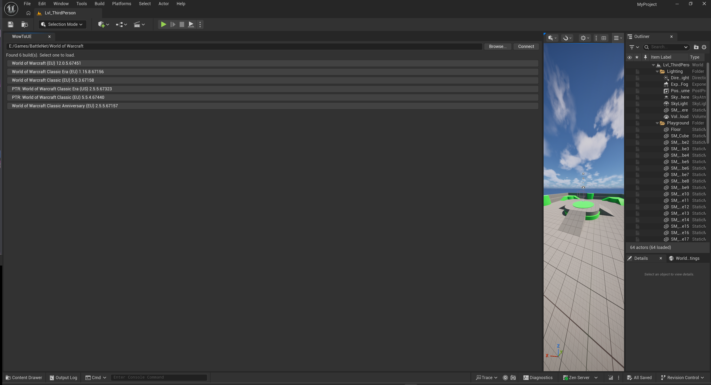
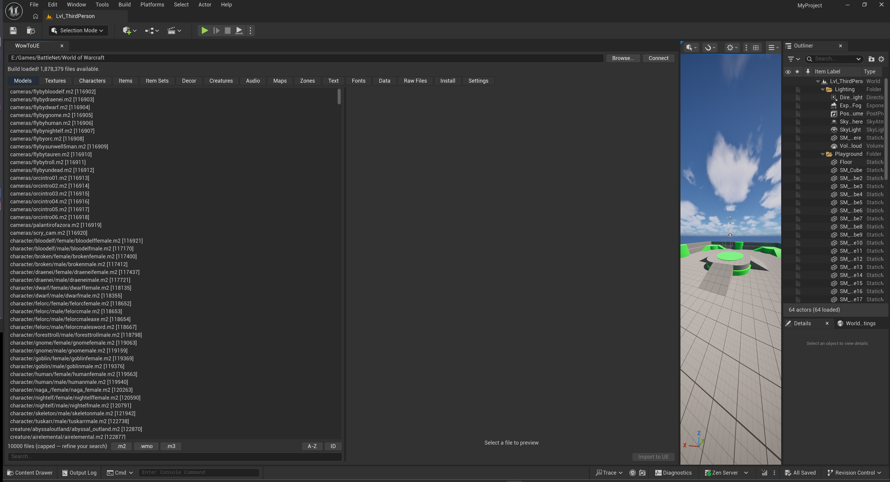
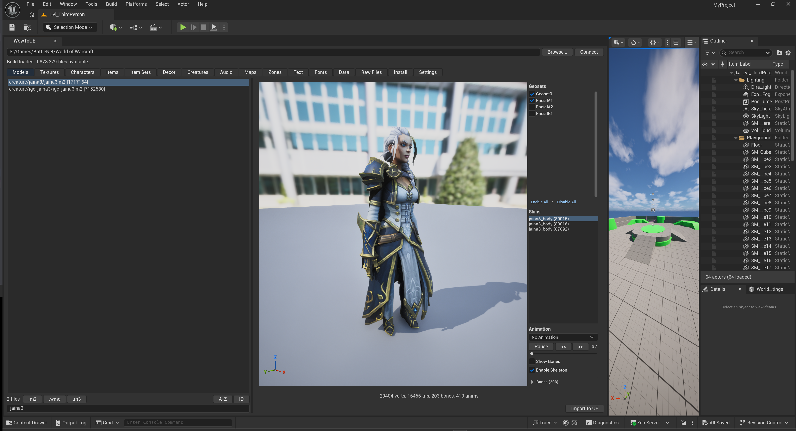
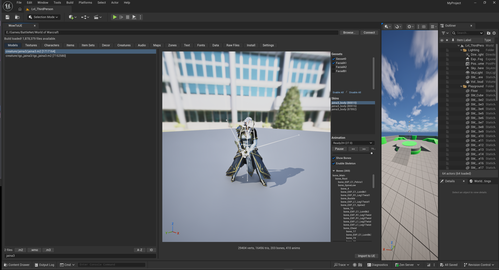

# WowToUE

An Unreal Engine 5.7 editor plugin for browsing and previewing World of Warcraft game assets from a local WoW installation.

## Current Features

- **CASC Browser** — Browse 1.8M+ files from a local WoW install across 15 categorised tabs
- **M2 Model Preview** — 3D viewport with skeletal mesh, GPU skinning, and animation playback
- **Animation** — Play, pause, step, and scrub through animations with dropdown selection
- **Creature Display** — Resolve creature textures and geoset overrides from DB2 tables
- **Geoset Control** — Toggle individual mesh sections (armor, hair, facial features)
- **BLP Textures** — Decode and display WoW's BLP texture format
- **Skeleton Visualisation** — UE-style wireframe bone rendering with bone hierarchy list
- **M3 Models** — Load and preview M3 format models

See [PROGRESS.md](PROGRESS.md) for detailed status and planned work.

## Architecture

| Module | Purpose |
|--------|---------|
| **WowLib** | C++ port of wow.export's core: CASC access, M2/SKEL/M3 loaders, DB2 parsing, BLP decoding |
| **WowToUERuntime** | UE bridge layer: coordinate conversion, model data structures |
| **WowToUEEditor** | Editor UI: CASC browser, 3D preview viewport |

See [Docs/CoordinateConversion.md](Docs/CoordinateConversion.md) for the WoW-to-UE coordinate transform reference.

## Inspired By

This project is built on the foundation of [wow.export](https://github.com/Kruithne/wow.export), an Electron-based WoW asset export tool. A significant portion of WowToUE's core code (CASC access, file format parsing, DB2 reading, BLP decoding) is a C++ port of wow.export's JavaScript codebase, adapted to compile within Unreal Engine's build system.

## Special Thanks

- **[Kruithne](https://github.com/Kruithne)** — Creator of [wow.export](https://github.com/Kruithne/wow.export), the tool that made WoW asset extraction accessible to everyone. WowToUE would not exist without this work.
- **[Marlamin](https://github.com/Marlamin)** — Major contributor to wow.export, creator of [wow.tools](https://wow.tools), and tireless reverse-engineer of WoW's file formats. Also maintains many of the community data resources this project depends on.

## Community Resources

| Resource | Purpose |
|----------|---------|
| [wowdev.wiki](https://wowdev.wiki) | WoW file format documentation (M2, SKEL, WMO, ADT, BLP, CASC, DB2, etc.) |
| [wowdev/wow-listfile](https://github.com/wowdev/wow-listfile) | Community-maintained file ID to path mapping |
| [wowdev/TACTKeys](https://github.com/wowdev/TACTKeys) | CASC encryption keys |
| [wowdev/WoWDBDefs](https://github.com/wowdev/WoWDBDefs) | DB2 database schema definitions |

## Third-Party Libraries

| Library | License | Purpose |
|---------|---------|---------|
| [nlohmann/json](https://github.com/nlohmann/json) | MIT | JSON parsing |
| [cpp-httplib](https://github.com/yhirose/cpp-httplib) | MIT | HTTP/HTTPS client |
| [stb](https://github.com/nothings/stb) | Public Domain | Image loading, writing, resizing |
| [OpenSSL](https://www.openssl.org/) | Apache 2.0 | TLS support for HTTPS |

## License

[MIT](LICENSE)
